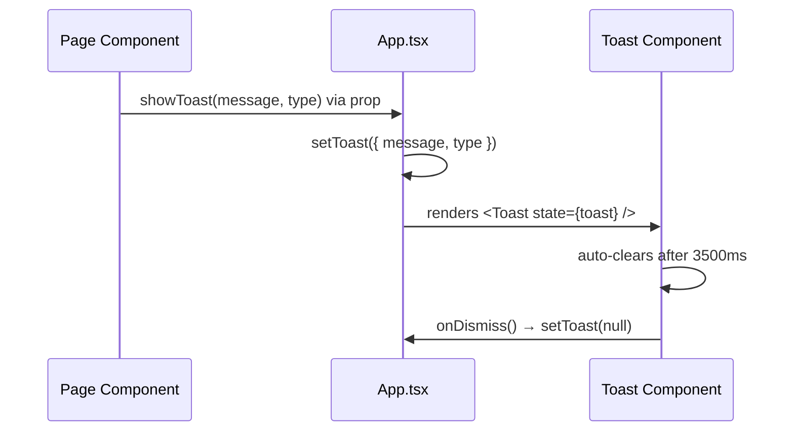
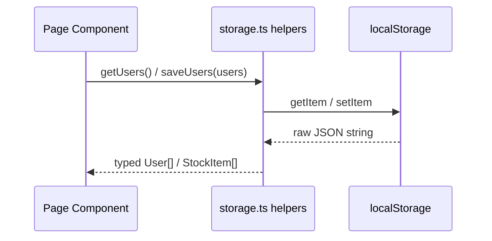

# Design Document

## Feature: gym-membership-react

Converting the GYMFIT HTML/CSS/JS website to a React TypeScript (Vite) application.

---

## Overview

The GYMFIT website is a multi-page HTML/CSS/JavaScript application. This design converts it into a single-page React TypeScript application using Vite as the build tool. The conversion preserves all visual design, content, and user-facing functionality while replacing direct DOM manipulation with React state management, replacing `window.location.href` navigation with React Router v6, and replacing scattered `<script>` tags with a typed component tree.

The result is a maintainable, type-safe SPA where each page is an isolated React component, shared UI (Navbar, Footer) is rendered once in `App.tsx`, and all side effects (localStorage reads/writes, navigation after delays) are handled through React hooks.

**Key design goals:**
- Zero new runtime dependencies beyond `react`, `react-dom`, `react-router-dom`, and the Vite/TypeScript toolchain.
- All CSS in a single `src/index.css` — no CSS modules, no styled-components.
- No more than two CSS classes per JSX element across the entire codebase.
- All localStorage interactions go through plain TypeScript helper functions in `src/utils/storage.ts`.
- Toast state is lifted to `App.tsx` and passed down via props so there is one toast renderer for the whole app.

---

## Architecture

The application follows a flat component architecture. There is no global state library (no Redux, no Zustand). State is local to each page component, with the single exception of Toast state which lives in `App.tsx`.

```mermaid
graph TD
    A[main.tsx] --> B[BrowserRouter]
    B --> C[App.tsx]
    C --> D[Navbar]
    C --> E[Routes]
    C --> F[Footer]
    C --> G[Toast]
    E --> H[/ → Home]
    E --> I[/login → Login]
    E --> J[/signup → Signup]
    E --> K[/dashboard → Dashboard]
    E --> L[/services → Services]
    E --> M[/contact → Contact]
    E --> N[* → Navigate to /]
```

**Data flow for Toast:**



**Data flow for localStorage:**



---

## Components and Interfaces

### File Structure

```
gym-membership-react/
├── public/
│   └── images/
│       ├── 1.jpg
│       ├── 2.jpg
│       ├── 3.jpg
│       ├── 4.jpg
│       └── 5.jpg
├── src/
│   ├── components/
│   │   ├── Navbar/
│   │   │   └── page.tsx
│   │   └── Footer/
│   │       └── page.tsx
│   ├── pages/
│   │   ├── Home/
│   │   │   └── page.tsx
│   │   ├── Login/
│   │   │   └── page.tsx
│   │   ├── Signup/
│   │   │   └── page.tsx
│   │   ├── Dashboard/
│   │   │   └── page.tsx
│   │   ├── Services/
│   │   │   └── page.tsx
│   │   └── Contact/
│   │       └── page.tsx
│   ├── utils/
│   │   └── storage.ts
│   ├── App.tsx
│   ├── App.css          ← empty file
│   ├── index.css        ← all styles
│   └── main.tsx
├── index.html
├── package.json
├── tsconfig.json
└── vite.config.ts
```

### Component Descriptions

**`main.tsx`**
Bootstraps the React app. Wraps `<App />` in `<BrowserRouter>`. Imports `./index.css` as the sole global stylesheet.

**`App.tsx`**
Root component. Renders `<Navbar>`, a `<Routes>` block with all six page routes plus a catch-all `<Navigate to="/" />`, `<Footer>`, and `<Toast>`. Owns `toastState: ToastState | null` via `useState`. Passes a `showToast` callback prop down to every page component that needs it.

**`Navbar/page.tsx`**
Uses `useLocation` to determine the active route and applies the `active` CSS class to the matching `<Link>`. Uses `<Link>` from `react-router-dom` for all navigation — no `window.location.href`.

**`Footer/page.tsx`**
Static component. Uses `<Link>` for internal routes and `<a>` for external/placeholder links.

**`Home/page.tsx`**
Purely presentational. Renders hero, benefits strip, programs grid, why-section, stats, testimonials, and CTA banner. Uses `useNavigate` for button clicks that navigate to `/signup` and `/services`.

**`Login/page.tsx`**
Manages `formValues` and `fieldErrors` with `useState`. On submit: validates fields, checks `gymfit_users` in localStorage via `getUsers()`, writes `gymfit_logged_in` via `setLoggedInUser()`, calls `showToast`, then `setTimeout(() => navigate('/dashboard'), 1500)`.

**`Signup/page.tsx`**
Manages `formValues` and `fieldErrors` with `useState`. On submit: runs all five validation rules in order, checks for duplicate email, appends new `User` to `gymfit_users`, writes `gymfit_logged_in`, calls `showToast`, then navigates to `/dashboard` after 1500 ms.

**`Dashboard/page.tsx`**
On mount: reads `gymfit_logged_in` — if absent, navigates to `/login`. Reads `gymfit_stock` into `stockItems` state via `useEffect`. Manages `activeView: 'cards' | 'table' | 'insert' | 'update'` state. The update modal is controlled by `editingItem: StockItem | null` and `editingIndex: number | null` state.

**`Services/page.tsx`**
Purely presentational. Renders hero and six service cards.

**`Contact/page.tsx`**
Manages `formValues` and `fieldErrors` with `useState`. On submit: validates name, email, and message; appends to `gymfit_messages` via `saveMessages()`; calls `showToast`; resets form.

**`Toast` (inline in App.tsx or a small sub-component)**
Renders a fixed-position `<div>` when `toastState` is non-null. Uses `useEffect` to call `onDismiss` after 3500 ms whenever `toastState` changes.

**`storage.ts`**
Plain TypeScript helper functions — no class, no singleton. Exported functions:
- `getUsers(): User[]`
- `saveUsers(users: User[]): void`
- `getLoggedInUser(): User | null`
- `setLoggedInUser(user: User): void`
- `removeLoggedInUser(): void`
- `getStock(): StockItem[]`
- `saveStock(items: StockItem[]): void`
- `getMessages(): ContactMessage[]`
- `saveMessages(messages: ContactMessage[]): void`

---

## Data Models

All interfaces live in `src/types.ts` (or can be co-located in `storage.ts`).

```typescript
// A registered gym member
interface User {
  name: string;       // full name
  email: string;      // unique identifier
  password: string;   // stored as plain text (matches original app behaviour)
  joined: string;     // toLocaleDateString() at registration time
}

// A gym inventory item
interface StockItem {
  name: string;       // item name, non-empty
  category: string;   // category label, non-empty
  quantity: number;   // non-negative integer
  price: number;      // non-negative, PKR
  date: string;       // toLocaleDateString() at insertion time; never mutated on update
}

// A contact form submission
interface ContactMessage {
  name: string;
  email: string;
  subject: string;
  message: string;
  date: string;       // toLocaleString() at submission time
}

// Toast notification state
interface ToastState {
  message: string;
  type: 'success' | 'error';
}
```

**localStorage key mapping:**

| Key | Type | Description |
|---|---|---|
| `gymfit_users` | `User[]` | All registered accounts |
| `gymfit_logged_in` | `User` | Currently authenticated user |
| `gymfit_stock` | `StockItem[]` | Gym inventory records |
| `gymfit_messages` | `ContactMessage[]` | Contact form submissions |

---

## Correctness Properties

*A property is a characteristic or behavior that should hold true across all valid executions of a system — essentially, a formal statement about what the system should do. Properties serve as the bridge between human-readable specifications and machine-verifiable correctness guarantees.*

### Property 1: Active nav link matches current route

*For any* valid route path (`/`, `/services`, `/contact`, `/dashboard`, `/login`, `/signup`), when the Navbar is rendered with that location, exactly one nav link should have the `active` CSS class and its `to` prop should equal the current pathname.

**Validates: Requirements 3.5, 4.3**

---

### Property 2: CSS class count constraint

*For any* JSX element across all components and pages, the `className` attribute should contain no more than two space-separated class names.

**Validates: Requirements 4.4, 5.4, 6.8, 7.6, 8.9, 9.3, 10.7, 11.12, 13.1**

---

### Property 3: Login validation rejects empty fields

*For any* combination of form inputs where the username field or the password field is empty (or both), submitting the Login form should produce at least one inline field error and should not write to `gymfit_logged_in` in localStorage.

**Validates: Requirements 7.2**

---

### Property 4: Signup validation enforces all rules

*For any* signup form submission where at least one of the following is true — full name is empty, email is invalid, password fails the strength rule (fewer than 8 chars, or no letter, or no digit), confirm password does not match, or email already exists in `gymfit_users` — the form should display the corresponding inline error and should not append to `gymfit_users` or write to `gymfit_logged_in`.

**Validates: Requirements 8.2, 8.3, 8.4, 8.5, 8.6**

---

### Property 5: Contact form validation rejects invalid inputs

*For any* contact form submission where the name is empty, the email is invalid or empty, or the message is empty, the form should display the corresponding inline error and should not append to `gymfit_messages` in localStorage.

**Validates: Requirements 10.2, 10.3, 10.4**

---

### Property 6: Dashboard initialises from localStorage

*For any* array of `StockItem` records stored in `gymfit_stock` before the Dashboard mounts, the Dashboard's `stockItems` state after mount should be deeply equal to that stored array.

**Validates: Requirements 11.2**

---

### Property 7: Stock table renders all items

*For any* non-empty array of `StockItem` records in Dashboard state, activating the "View All Stock" view should render a table with exactly as many data rows as there are items in the array, and each row should display the corresponding item's name, category, quantity, price, and date.

**Validates: Requirements 11.3, 11.10**

---

### Property 8: Stock insertion round-trip

*For any* valid set of stock fields (non-empty name and category, non-negative numeric quantity and price), submitting the Insert form should result in a new `StockItem` appearing at the end of both the Dashboard's `stockItems` state and the `gymfit_stock` localStorage array, with all field values matching the submitted inputs.

**Validates: Requirements 11.5**

---

### Property 9: Invalid stock insertion leaves state unchanged

*For any* invalid stock form submission (empty name, empty category, negative quantity, or negative price), the Dashboard's `stockItems` state and the `gymfit_stock` localStorage array should be identical before and after the submission attempt.

**Validates: Requirements 11.6**

---

### Property 10: Stock update preserves original date

*For any* `StockItem` in the stock list, submitting the Update modal with valid new values for name, category, quantity, and price should update those four fields in state and localStorage while leaving the `date` field unchanged from its original value.

**Validates: Requirements 11.8**

---

### Property 11: Stock deletion removes item from state and storage

*For any* `StockItem` at any index in the stock list, confirming its deletion should result in that item no longer appearing in the Dashboard's `stockItems` state or in the `gymfit_stock` localStorage array, and the array length should decrease by exactly one.

**Validates: Requirements 11.9**

---

### Property 12: Toast background colour matches type

*For any* message string, a Toast triggered with type `"success"` should render with background colour `#7b2ff7`, and a Toast triggered with type `"error"` should render with background colour `#e53935`.

**Validates: Requirements 12.2, 12.3**

---

### Property 13: Auth persistence round-trip

*For any* valid `User` object, after a successful login or signup that writes the user to `gymfit_logged_in`, calling `getLoggedInUser()` should return an object deeply equal to the written user.

**Validates: Requirements 14.1**

---

### Property 14: Dashboard redirects when unauthenticated

*For any* application state where `gymfit_logged_in` is absent from localStorage, mounting the Dashboard component should trigger navigation to `/login` without rendering the dashboard content.

**Validates: Requirements 14.3**

---

## Error Handling

### Form Validation Errors
All form pages (Login, Signup, Contact, Dashboard Insert/Update) follow the same pattern:
1. On submit, run all validation checks synchronously.
2. Collect errors into a `fieldErrors` object keyed by field name.
3. If any errors exist, call `setFieldErrors(errors)` and return early — no localStorage writes, no navigation.
4. Each input renders a `<span className="field-error">` below it when `fieldErrors[fieldName]` is non-empty.
5. Errors are cleared on the next submit attempt (not on keystroke, to avoid distracting the user mid-type).

### Toast Errors
Actions that fail at the business logic level (wrong credentials, stock not found) use the `showToast(message, 'error')` callback rather than inline field errors.

### Auth Guard
The Dashboard reads `gymfit_logged_in` inside a `useEffect` on mount. If the value is `null`, it calls `navigate('/login')` immediately. This prevents the dashboard content from flashing before the redirect.

### localStorage Parse Errors
All `storage.ts` helpers wrap `JSON.parse` in a try/catch and return the appropriate empty default (`[]` or `null`) on failure. This prevents a corrupted localStorage entry from crashing the app.

### Unknown Routes
`App.tsx` includes a catch-all route `<Route path="*" element={<Navigate to="/" replace />} />` as the last entry in the `<Routes>` block.

---

## Testing Strategy

### Property-Based Testing

The project uses **fast-check** (TypeScript-native PBT library) for property tests. Each property test runs a minimum of **100 iterations**.

Each test is tagged with a comment in the format:
```
// Feature: gym-membership-react, Property N: <property text>
```

Properties 1–14 above map directly to property-based tests. The key generators needed are:

- `fc.constantFrom('/', '/login', '/signup', '/dashboard', '/services', '/contact')` — valid route paths
- `fc.record({ name: fc.string(), email: fc.emailAddress(), password: fc.string(), joined: fc.string() })` — User records
- `fc.record({ name: fc.string({ minLength: 1 }), category: fc.string({ minLength: 1 }), quantity: fc.nat(), price: fc.nat() })` — valid StockItem fields
- `fc.string()` — arbitrary toast messages
- `fc.oneof(fc.constant('success'), fc.constant('error'))` — toast types

**Test file locations:**
- `src/__tests__/Navbar.property.test.tsx` — Properties 1, 2 (Navbar)
- `src/__tests__/Login.property.test.tsx` — Property 3
- `src/__tests__/Signup.property.test.tsx` — Property 4
- `src/__tests__/Contact.property.test.tsx` — Property 5
- `src/__tests__/Dashboard.property.test.tsx` — Properties 6–11
- `src/__tests__/Toast.property.test.tsx` — Property 12
- `src/__tests__/storage.property.test.ts` — Property 13
- `src/__tests__/Dashboard.auth.property.test.tsx` — Property 14

### Unit / Example-Based Tests

Unit tests cover specific scenarios and integration points that are not universal properties:

- **Routing**: Render `<App>` with `MemoryRouter` at an unknown path and assert redirect to `/`.
- **Login success**: Seed localStorage with a user, submit matching credentials, assert `gymfit_logged_in` is set and navigation is triggered after 1500 ms (using `jest.useFakeTimers`).
- **Login failure**: Submit non-matching credentials, assert error toast is shown.
- **Signup success**: Submit a valid new-user form, assert user appended to `gymfit_users` and navigation triggered.
- **Contact success**: Submit a valid contact form, assert message appended to `gymfit_messages` and form fields reset.
- **Toast auto-dismiss**: Trigger a toast, advance fake timers by 3500 ms, assert toast is no longer rendered.
- **Logout**: Set `gymfit_logged_in`, click logout button, assert key removed and navigation to `/login` after 1500 ms.
- **Services page**: Render Services page, assert 6 service cards are present.
- **Footer links**: Render Footer, assert internal links use `<Link>` and external links use `<a>`.

### Test Setup

- **Test runner**: Vitest (ships with Vite)
- **DOM environment**: jsdom (via `@vitest/jsdom` or `happy-dom`)
- **React testing**: `@testing-library/react` + `@testing-library/user-event`
- **PBT library**: `fast-check`
- **Timer mocking**: Vitest's built-in `vi.useFakeTimers()`

Unit tests focus on concrete examples and integration points. Property tests handle broad input coverage. Together they provide comprehensive correctness guarantees without redundant overlap.
